<h1 align=center>贝塞尔曲线和贝塞尔曲面的绘制</h1>

[toc]

## 1 公式准备
### 1.1 贝塞尔曲线
#### 1.1.1 一阶贝塞尔曲线
&emsp;&emsp;贝塞尔曲线的核心思路是插值，由于一阶公式是基本公式，这里直接给出公式：
<div align=center>   
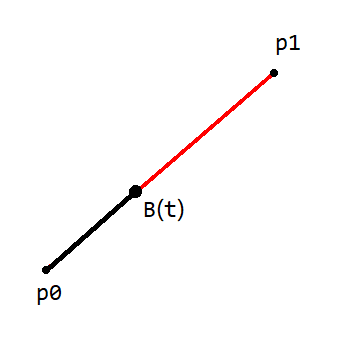
</div>

$$
\begin{aligned}
B(t) &= \vec{P_0} + (\vec{P_1} - \vec{P_0}) \cdot t\\
B(t) &= (1-t)\vec{P_0} + t\vec{P_1}
\end{aligned}
$$
#### 1.1.2 二阶贝塞尔曲线
&emsp;&emsp;二阶贝塞尔曲线可通过一阶贝塞尔曲线公式推导而出，如下所示：
<div align=center>   
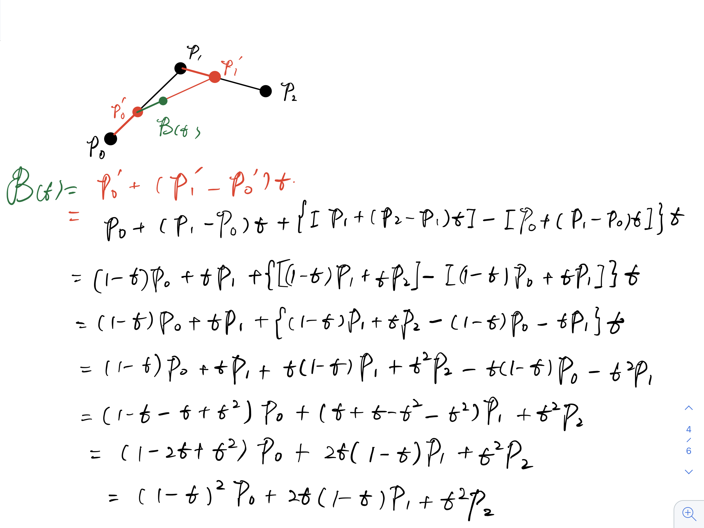
</div>

#### 1.1.3 三阶贝塞尔曲线
&emsp;&emsp;二阶贝塞尔曲线可通过一阶贝塞尔曲线和二阶贝塞尔曲线公式推导而出，如下所示：
<div align=center>   
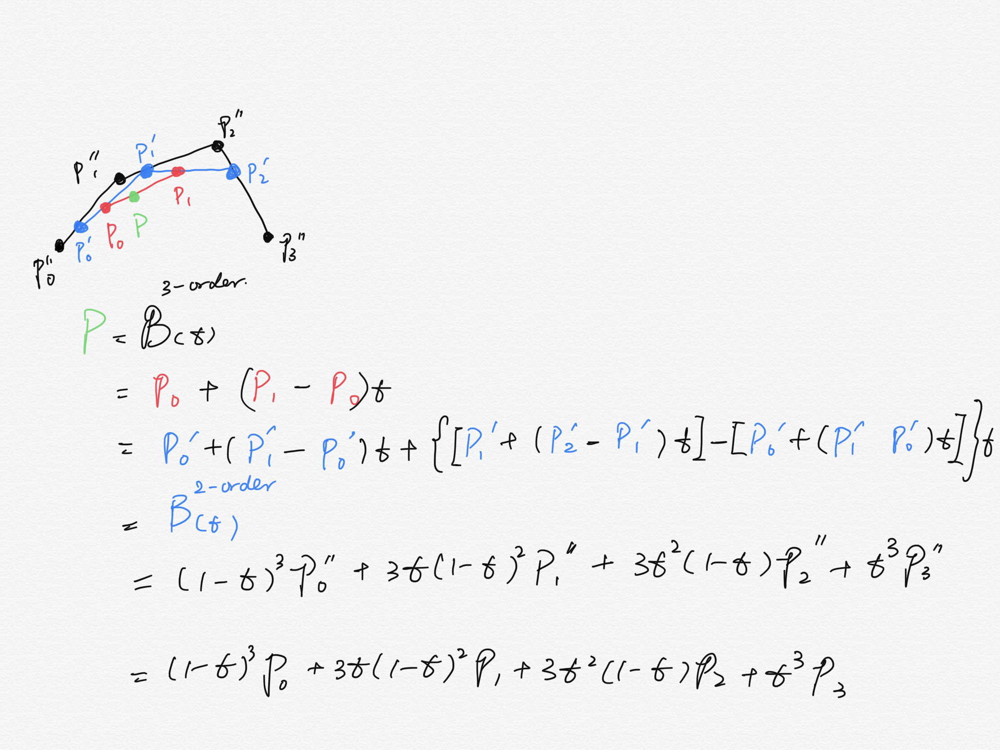
</div>

#### 1.1.4 N 阶贝塞尔曲线
&emsp;&emsp;我们补全三阶贝塞尔曲线的各项参数，如下所示：
$$B^{(3)}(t) = 1t^{0}(1-t)^{3}P_{0} + 3t(1-t)^{2}P_{1} + 3t^{2}(1-t)^{1}P_{2} + t^{3}P_{3}$$
我们用 i 记录 P 的下标，从 0 开始，用 n 表示阶数，则上述公式可写作：
$$B^{(n)}(t) =\sum^{n}_{i=0}C^{i}_{n}t^{i}(1-t)^{n-i}P_{i}$$
这里的 C 表示组合数。
## 2. Bezier 类
### 2.1 贝塞尔曲线
&emsp;&emsp;这里只绘制了控制点连续的 1，2，3 阶贝塞尔曲线，后续会更新至 N 阶。
#### 2.1.1 曲线
&emsp;&emsp;绘制曲线有两种办法：
1. **用连续的，半径为 r 的采样点相互连接，构成曲线**
2. **用连续的，互相连接的线段构成曲线，线段的数量决定了曲线的分辨率。**

我们从第一种方法开始看。
&emsp;&emsp;**第一种方法**是用大小相同的连续的采样点相互连接，构成曲线。方便起见，我们把需求修改为：用采样点绘制一个 10cm 的线段。减少计算量的方法是，用直径为 1cm 彼此相切的圆构成一条线段，如下图所示：
<div align=center>   
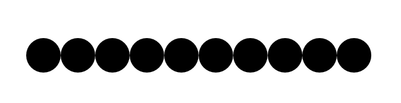
</div>

该方法的缺陷如下：
1. 采样点之间彼此是有空缺的，虽然可以使用抗锯齿的思路弥补，但需要绘制的线段太长时，就不得不考虑使用大量彼此连接的采样点做出连续线段的效果。
2. 对高分辨率显示屏来说，同样长度（用 cm 丈量）的线段，高分辨率显示器需要显卡画出更多的采样点，而如果根据固定的分辨率写死数量计算，则该程序可能并不适用于其他分辨率的情况。

因此我放弃了使用第一种方法。
&emsp;&emsp;**第二种方法**使用大小相同的连续线段相互连接，如下图所示：
<div align=center>   
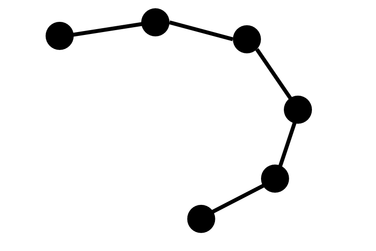
</div>

它解决了上述提到的两个缺陷：
1. 需要绘制的曲线过长时，虽然会损失精度，但不会造成曲线不连续。
2. 高分辨率和低分辨率需要绘制的采样点数量一致。

以及下面这几个优点：
1. 精度较低的应用场景中，能绘制连续曲线
2. 在之后拖拽控制点重新绘制曲线时，不需要做多余的计算（如果用采样点绘制，为了保证连续性，有可能需要重新计算需要绘制的采样点的数量以及采样点的位置）

因此这里我选用了第二种方法绘制贝塞尔曲线。

#### 2.1.2 与曲线绘制有关的采样点计算
&emsp;&emsp;因为我们使用的是第一种方法，所以绘制曲线中，采样点计算的步骤如下：
1. 用户给出控制点坐标。
2. 根据不同阶数实现贝塞尔曲线函数
3. 根据控制点坐标计算出曲线上的采样点

我们从一步一步开始看。
**1. 用户给出控制点坐标**
&emsp;&emsp;方便起见，这里我们用 float 数组标记输入的坐标：
```c++
float positions[] = {
    // x    y
    0.6,   0.1;
    ......
}
```
**2. 根据不同阶数实现贝塞尔曲线函数，以计算曲线上的采样点**
&emsp;&emsp;贝塞尔曲线函数本身的参数其实不是很重要，重要的是如何从用户输入的数据中提取控制点坐标，用高效，简洁的方式计算出曲线上的采样点。我在中间想了两种方法：
**第一种方法**：
&emsp;&emsp;将读取到的数据，按照 x，y 的方式存入一个 vector2 数组，vector2 是需要自己构建的结构体：
```
struct vector2{
    float x, y;
    // ...
};
```
再根据贝塞尔曲线的阶数，确定一个循环读取几个控制点坐标。但这样就意味着，我们需要额外拷贝一份儿数据，增加空间成本（这里可以用修改编译器对地址解析的方式，让编译器按照 vector2 类型的规则读取数据，例如将 const float* 转换为 const vector2*，但是比较危险）。
**第二种方法**：
&emsp;&emsp;既然最终都是要根据阶数取偏移量，我们为什么不直接在原数据上取控制点坐标呢？如下图所示：
<div align=center>   
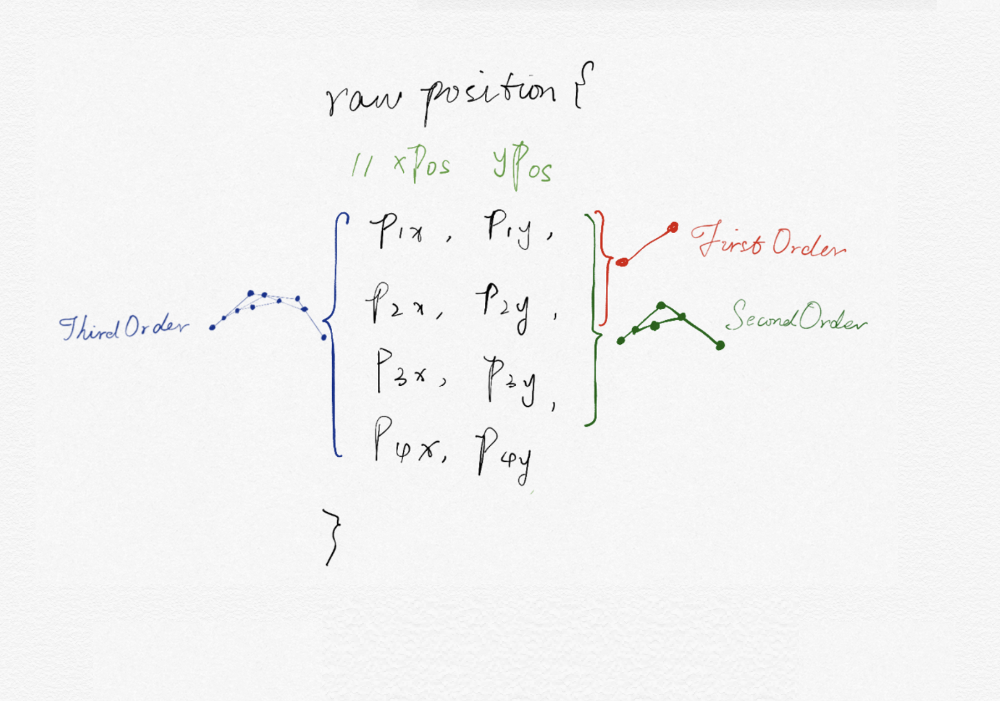
</div>

这种方法既不需要构建新的数据结构，也不需要额外拷贝数据。因此最终选择的是这个方法。
&emsp;&emsp;顶点数据有了，接下来我们就需要确定函数了，一到三阶贝塞尔函数公式如下所示：
<div align=center>   
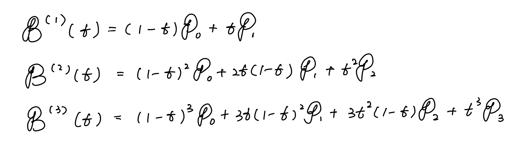
</div>

通过观察，我们发现，其中有许多重复的参数，由于控制点是一个二维向量，有 x 和 y 坐标，为了避免重复计算，我将参数都抽象成变量，根据要计算的阶数初始化它们，如下段代码所示：
```cpp
void InitializePositions(OrderType type) {
    // 贝塞尔曲线中需要用到的参数，按照行划分为 一阶贝塞尔曲线参数，
    // 二阶贝塞尔曲线参数， 三阶贝塞尔曲线参数
    float T, one_minus_T;
    float T_squre, one_minus_T_squre, two_T_one_minus_T, three_T_one_minus_T_square, three_T_square_one_minus_T;
    float T_cubic, one_minus_T_cubic;

    unsigned int LENGTH = control_point_cnt - ((unsigned int)type + 2);

    if (positions.size() == 0) {
        positions.reserve(LENGTH);			
    }		

    for(int g = 0; g <= LENGTH; g++){
        std::vector<float> position;
        position.reserve((LINE_RESOLUTION + 1) * DIMENSION);
        for (int t = 0; t <= LINE_RESOLUTION; t++) {
            // 参数						
            if (type == OrderType::FirstOrder || type == OrderType::SecondOrder || type == OrderType::ThirdOrder) {
                // 一次项参数
                T = (float)t / (float)LINE_RESOLUTION;
                one_minus_T = (1.0f - T);
            }
            if (type == OrderType::SecondOrder || type == OrderType::ThirdOrder) {
                // 二次项参数
                T_squre = std::pow(T, 2);
                one_minus_T_squre = std::pow(one_minus_T, 2);
                two_T_one_minus_T = 2.0f * T * one_minus_T;
                three_T_one_minus_T_square = 3.0f * T * one_minus_T_squre;
                three_T_square_one_minus_T = 3.0f * T_squre * one_minus_T;
            }
            if (type == OrderType::ThirdOrder) {
                // 三次项参数
                T_cubic = T * T_squre;
                one_minus_T_cubic = one_minus_T_squre * one_minus_T;
            }
        }
        // ...
    }		
}
```
#### 2.1.3 采样点之间的连接
&emsp;&emsp;由于 OpenGL 提供了关于直线绘制的底层实现，我在正真实现之前，也考虑过几种方法：
**1. 使用 GL_LINES**
&emsp;&emsp;OpenGL 底层实现了直线绘制的方法，我们只需要调用 glDrawArray()，并设置绘制模式为 GL_LINES，给出起始坐标下标和结束坐标下标即可。但是 GL_LINES 并不能满足我们的需要这与它的连接方式有关，如下图所示：
示：
<div align=center>   
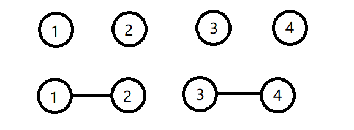
</div>

按照输入的顺序，每两个点读取一次，只连接读取到的两个点。这样绘制出的曲线，其样式和虚线一样，如果要在这种方法中给出连续的曲线，需要添加额外数据。本例中，需要额外添加 2，3 两点的坐标，造成数据冗余。
**2. 使用 GL_LINE_STRIP**
&emsp;&emsp;我们希望的是将所有点按顺序连接起来，形成连续的曲线，并且尽可能地减少数据量，GL_LINE_STRIP 满足我们的需求，其连接方式如下图所示：
<div align=center>   
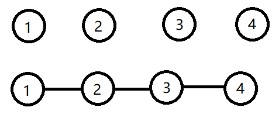
</div>

但是这样会出问题。
&emsp;&emsp;我们的思路是将曲线上的所有采样点计算出来（数量与精度有关），然后用 GL_LINE_STRIP 的方式连接它们。假如我们想绘制两个二阶贝塞尔曲线会怎样？我们希望得到的效果如下图所示：
<div align=center>   
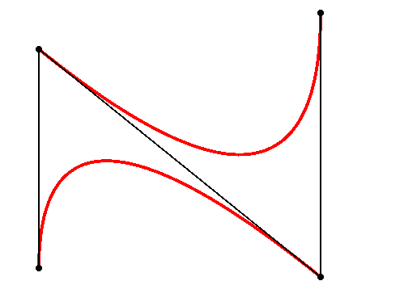
</div>

但是实际上，会得到这样的效果：
<div align=center>   
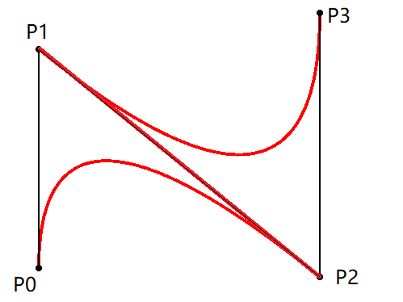
</div>

这是因为我们在绘制由 P0，P1，P2 构成的贝塞尔曲线时，保存了 P0 和 P2 两个控制点的坐标；之后再绘制由 P1，P2，P3 构成的贝塞尔曲线时，保存了 P1 和 P3 两个坐标，此时坐标点的顺序如下：
P0 ... P2, P1, ... P3
按照 GL_LINE_STRIP 的绘制方式，也就不难理解为什么会出现这种情况了。
&emsp;&emsp;这里我的解决办法是用一个数组，保存两组采样点，结构如下：
```cpp
positions[] = {
    pos_1{P0, ..., P2},
    pos_2{P1, ..., P3},
};
```
#### 2.1.4 鼠标拖拽控制点并重绘曲线
&emsp;&emsp;总是修改坐标来移动控制点其实是一件挺麻烦的事情，这里更希望能够做出交互的感觉，所以在这里添加了鼠标点击并拖拽控制点，重绘曲线的功能。实现思路如下：
1. 判断鼠标是否点击到控制点
2. 在鼠标拖动时，更新控制点坐标，重新绘制控制点
3. 根据更新后的控制点坐标，重新绘制曲线

我们一步一步来看。

**1. 判断鼠标是否点击到控制点上**
&emsp;&emsp;其实这个思路还是比较简单的，可以直接通过圆的方程来解决，公式如下：
$$(Cp_x - Mp_x)^2 + (Cp_y + Mp_y)^2 = R^2$$
其中 $Cp$ 表示 constrol point，$Mp$ 表示 Mouse point，R 则表示鼠标坐标到控制点圆心的距离。这里是直接计算鼠标坐标到控制点坐标的距离，判断这个距离是否小于控制点半径如下图示：
<div align=center>   
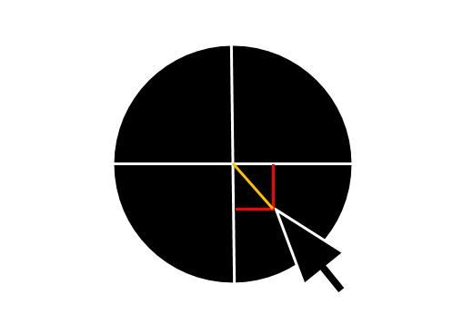
</div>

上述公式的 R 就是上图中的橙色线段。

**2. 在鼠标拖动时，更新控制点坐标，重新绘制控制点**
&emsp;&emsp;这里，我们最终要实现下图中的效果：
<div align=center>   
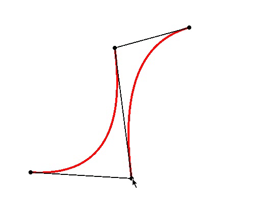
</div>

由于在判断鼠标是否有点击到控制点上这个步骤中，我们计算了鼠标和控制点的在 x 轴和 y 轴上的相对位置，我们可以从这里入手。具体步骤如下：
1. 点击鼠标左键时，获取鼠标位置
2. 根据鼠标位置计算出鼠标与控制点的相对位置
3. 在判断选中了控制点的情况下，移动鼠标，同时获取最新的坐标位置，根据计算出的相对位置，更新控制点位置
4. 重新绘制控制点

同时这里要注意，我们在拖拽控制点的时候，不可以让控制点被拖出窗口外，因此要做一个边界判断。

**3. 根据更新后的控制点坐标，重新绘制曲线**
&emsp;&emsp;在更新好控制点之后，这里就直接根据最新的控制点坐标，重新绘制曲线就好了